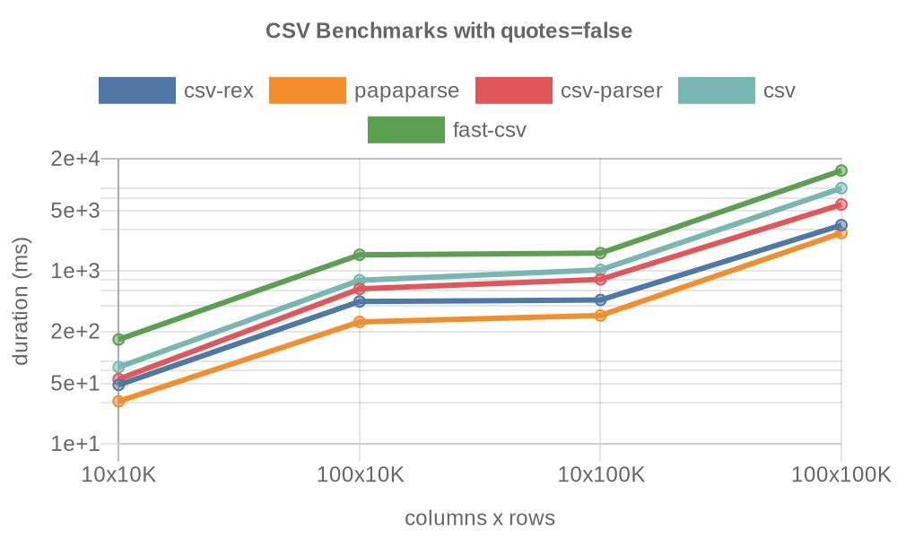
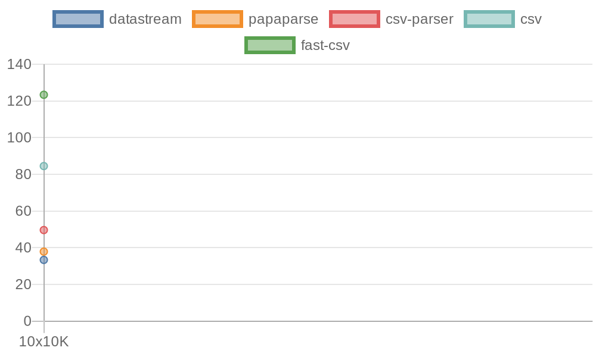

# JavaScript CSV Benchmarks

Benchmarks of popular CSV parsers:

* [csv-rex](https://github.com/willfarrell/csv-rex)
* [PapaParse](https://www.papaparse.com/)
* [csv-parser](https://www.npmjs.com/package/csv-parser)
* [csv-parse](https://csv.js.org/parse/)
* [fast-csv](https://www.npmjs.com/package/fast-csv)
  
The tests run on generated data files with 10/100 columns and 10k/100k/1M/10M rows, both quoted and unquoted.

## Results 
Benchmarked on GitHub Actions.

### Non-Quoted CSV files

### Quoted CSV Files

## Excluded

* [dekkai](https://www.npmjs.com/package/dekkai) unable to parse larger CSVs due to crashing

## Roadmap
- Add in more parsers
  - `stream-csv-as-json`
- Add in formatters
  - `csv-string`

This repo was inspired by leanylabs: [CSV Parsers Comparison](https://leanylabs.com/blog/js-csv-parsers-benchmarks/).